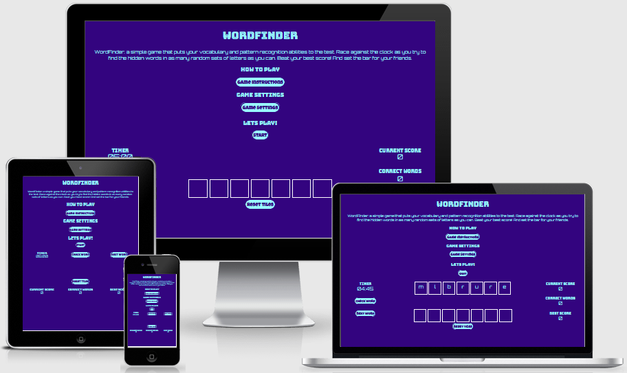

# WORDFINDER

## Site Overview
Wordfinder is a word-based game, where a user must find as many 4+ letter words in multiple sets of seven or eight randomly generated letters against the clock as they can. With the option of numerous different game settings, each providing its own stored and displayed best score for a user, the game is varied and long-lasting with regard to its enjoyment and playability. The target audience for this game is most broadly anyone who enjoys word-based games, of which there are many. 

## Design Process
This section details the stages of the design process followed during the development of the site.

### Strategy

#### User Stories
- As a player of word-based games, I prefer the game to be fairly intuitive, with instructions clear, concise and easy to access at any point during the game.
- As a player of online games, I like to be able to play the game on both mobile, tablet and desktop, without significant disruption to how the game looks and feels, or the mechanism by which I play it. I also prefer to not have to scroll, so that I can view the instructions, game setup and playing areas all at once, thus remaining fully immersed in the game itself.
- As a fan of browser-based games including word games, I always want simple playing controls. Additionally I want the game related buttons to make it effortless to start and quit the game, as well as change any settings.
- As a player of word-based games I like there to be feedback that not only provides the information I need, but does so in an appealing fashion.  I also like to have game sounds as part of this feedback which makes it fun to play; although I want to be able to easily disable/enable the sounds when desired.
- As a fan of word games, I like there to be a moderate degree of variability in a game, with multiple game modes that change the difficulty of the game, as well as how long it takes to complete: often I may only want a short game as I only have a small amount of time.
- As someone who plays word games, I like there to be information displayed during a game and at the end of a game summarising my performance, particularly if I am trying to achieve some target against the clock, where knowing what my current score is and how much time I have left simultaneously, is a necessity for it to be worthwhile.
- As a competitive gamer, I want any single player game, to have some kind of metric of my performance that allows me to indirectly compete with other players.

#### Site Owner Story
The goal is to produce a word-based game that is entertaining to the user, and of sufficient variability as to not become too repetitive and dull.  As well as being entertaining, the game should also provide a form of mental stimulation akin to brain training games, in that it challenges the user to focus and search for words in sets of random letters, whilst under time pressure. Finally the game should have a competitive component, whereby users can compare their performance with other users.

### Scope

#### Site key functions and content:
In order to meet the goal of the site owner, as well as satisfy the potential users, the site-hosted word game will minimally require the following functions and content:
- It should be fully responsive and or adaptive to all types of device, in a way that removes any need for page scrolling and maintains a consistent appearance
- An easy-to-access and concise set of game instructions
- An easy-to-access and modify set of game settings, providing multiple game mode options
- Have game mechanics that prevent it being repetitive, with every game being different
- Provide appealing feedback to a player during and at the end of a game
- Include sound effects, that can be disabled and enabled at the discretion of the player
- Provide a straightforward game interface/game controls to play the game, that are fairly intuitive so that minimal instructions are needed.
- Have a displayed game timer 
- Display and produce various metrics that give a player useful information during a game for the purpose of achieving a target such as a new best score
- Have a competitive metric such as the best score for each different game mode, that can be stored and updated locally for every player

